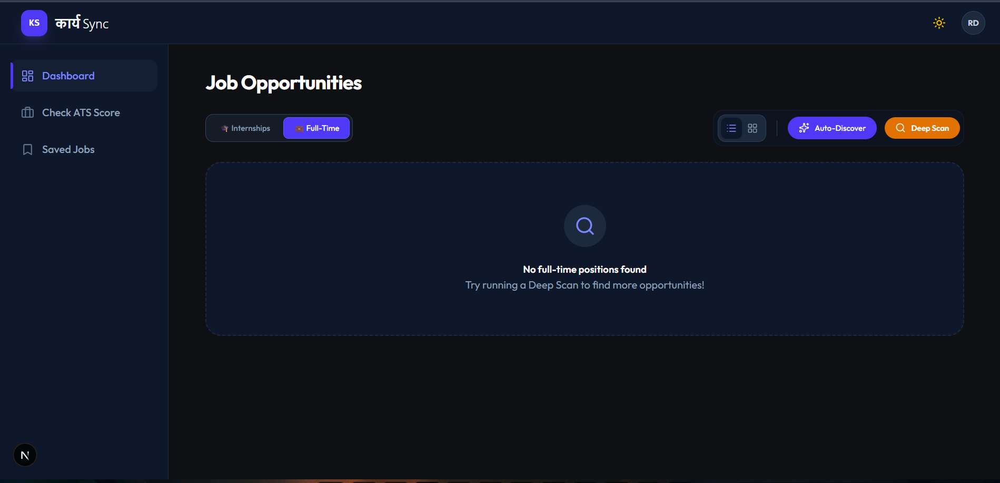

# 🚀 KaryaSync

> **The Operating System for Your Career.**
> Find jobs and optimize your resume—all in one privacy-focused dashboard.



## 🌟 Why KaryaSync?
Finding a job is chaotic. You have 50 tabs open and no idea if your CV actually matches the Job Description.

**KaryaSync solves this by unifying the workflow:**
1.  **Job Aggregator:** Real-time job feed powered by the **Adzuna API** to consolidate listings.
2.  **ATS Optimizer:** Instantly checks your Resume vs. Job Description to give you a "Match Score."
3.  **Privacy First:** No data selling. Your resume analysis stays local.

## 📸 Core Features

| Job Opportunities | ATS Optimizer |
|:---:|:---:|
|  |  |
| *Real-time Job Feed* | *AI Resume Scoring* |

## 🛠️ Tech Stack

**Frontend:**
* **Framework:** Next.js 14 (App Router)
* **Styling:** Tailwind CSS (Slate & Indigo Theme)
* **Font:** Space Mono & Plus Jakarta Sans
* **PWA:** Fully installable Desktop/Mobile App

**Backend & Data:**
* **Database:** Supabase (PostgreSQL)
* **Job Data:** Adzuna API
* **Deployment:** Vercel

## ⚡ Key Features
- **Progressive Web App (PWA):** Installs as a native app on Windows/Android.
- **Dark Mode UI:** Eye-friendly "Slate-900" professional theme.
- **Live Job Feed:** Fetches real-time job listings using Adzuna.
- **Match Score:** Calculates resume compatibility for specific roles.

## 🗺️ Roadmap (Future Updates)
- [ ] **Application Tracking Kanban:** Drag-and-drop board to track applied jobs.
- [ ] **Browser Extension:** One-click save from LinkedIn.
- [ ] **Email Integration:** Auto-detect interview invites.

## 🚀 Getting Started

To run this project locally:

1.  **Clone the repo**
    ```bash
    git clone [https://github.com/Rupam-Das-07/KaryaSync.git](https://github.com/Rupam-Das-07/KaryaSync.git)
    ```

2.  **Install Dependencies**
    ```bash
    npm install
    ```

3.  **Set up Environment Variables**
    Create a `.env.local` file and add your keys:
    ```bash
    NEXT_PUBLIC_SUPABASE_URL=your_url
    NEXT_PUBLIC_SUPABASE_ANON_KEY=your_key
    NEXT_PUBLIC_ADZUNA_APP_ID=your_id
    NEXT_PUBLIC_ADZUNA_API_KEY=your_key
    ```

4.  **Run the App**
    ```bash
    npm run dev
    ```

---
*Built with ❤️ by Rupam Das*
